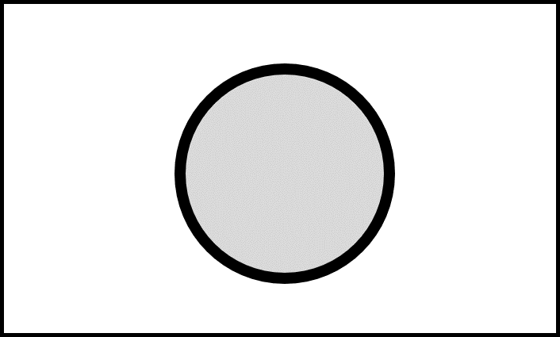

:::::::::::::::::::::::::::::::::::::: questions

- When creating a chart, what components do I have to work with?
- Which chart components are easier for people to perceive accurately?
- How can graphical elements and their visual properties support a chart's message?

::::::::::::::::::::::::::::::::::::::::::::::::

::::::::::::::::::::::::::::::::::::: objectives

- List the graphical elements and their visual properties that are available for chart design
- Choose chart components that are easier for people to perceive accurately
- Compare factors that result in "better" and "worse" charts

::::::::::::::::::::::::::::::::::::::::::::::::

## Graphical elements and visual properties

When we create a chart, we can choose many different ways to represent the message we wish to convey. But in two or three dimensions, there are only a few graphical elements we have to work with[^1]:

- Point
- Line
- Area
- Volume

The data and data relationships we are representing in a chart have different quantities and categories. We can communicate this information through a graphical element's visual properties[^2]:

 - Position
 - Alignment on one or more scales
 - Length
 - Direction
 - Angle
 - Size (amount of Area or Volume)
 - Curvature
 - Shading
 - Color

[^1]: Bertin, J. (1981). Graphics and graphic information-processing (W. J. Berg & P. Scott, Trans.). de Gruyter.

[^2]: Cleveland, W. S., & McGill, R. (1984). Graphical perception — Theory, experimentation, and application to the development of graphical methods. Journal of the American Statistical Association, 79(387), 531–554. https://doi.org/10.2307/2288400

::::::::::::::::::::::::::::::::::::: challenge

## Challenge 1: Match the name of the visual property to its picture

Use this list of visual properties to label the figures below[^3].

1. Position on a common scale
2. Position on non-aligned scales
3. Length
4. Direction
5. Angle
6. Size (Area)
7. Size (Volume)
8. Curvature
9. Shading
10. Color

### Figures

{alt='color property'}

{alt='angle property'}

{alt='1 scale position property'}

{alt='curve property'}

{alt='shading property'}

{alt='area property'}

{alt='direction property'}

{alt='2 scale position property'}

{alt='length property'}

{alt='volume property'}

[^3]: Images in this challenge adapted under a [CC-BY-4.0](http://creativecommons.org/licenses/by/4.0/) license from Briney, K. (2017). "Data Visualization Camp Instructional Materials (2017)" University of Wisconsin Milwaukee Libraries Instructional Materials. https://dc.uwm.edu/lib_staff_files/4

:::::::::::::::::::::::: solution

## Answers

| Visual Property Number | Visual Property Picture |
|:---:|:---:|
| 10  | Figure 2.1 |
|  5  | Figure 2.2 |
|  1  | Figure 2.3 |
|  8  | Figure 2.4 |
|  9  | Figure 2.5 |
|  6  | Figure 2.6 |
|  4  | Figure 2.7 |
|  2  | Figure 2.8 |
|  3  | Figure 2.9 |
|  7  | Figure 2.10 |

:::::::::::::::::::::::::::::::::

:::::::::::::::::::::::::::::::::::::

## Better visual representations

Depicting information visually is as much art as science, but some research-backed guidelines can help us design a chart that is easier for people to perceive accurately. These guidelines are the result of experiments conducted by two statisticians in the 1980s[^2]. Despite their study's limitations, the guidelines they produced remain useful and inform modern guidance about designing charts[^4].

The study in question attempted to define the individual components of visual representation and determine which components led to more accurate judgments about the underlying data. From better to worse, The authors ranked the ten visual properties we just learned in order from better to worse. For our purposes, "better" means that the chart is easier to perceive accurately, while "worse" means that the chart is more difficult to perceive accurately. The ranking is:

1. Position on common scale
2. Position on non-aligned scales
3. Length, direction, angle
4. Area
5. Volume, curvature
6. Shading, color saturation

Some properties appear together because there was not enough information to differentiate them.

Next time: work in the approach from the slides that takes the ranking on in terms of point, line, and area

[^4]: Evergreen, S. D. H. (2017). Effective data visualization: The right chart for the right data. Los Angeles: SAGE.

## Support your chart's message

These ten visual properties create many possible design variations for points, lines, area, and volume. With so many available options for visualizing information on a chart, it is important to remember the purpose of a chart.

::::::::::::::::::::::::::::::::::::: callout

The purpose of a chart is to communicate a message about patterns or relationships present in the data.

::::::::::::::::::::::::::::::::::::::::::::::::

Depicting information visually is as much art as science, but some research-backed guidelines can help us design a chart that supports our message rather than one that detracts or distracts from our message.

Exercise ideas:

- Use the hierarchy to choose which chart method will more accurately communicate a message (make these as examples)
  - A chart that depicts percentages of parts that make up a whole
    - 100% bar chart
    - pie chart
  - A chart that compares two categories over a period of time
    - Line chart with two lines shown in contrasting colors
    - Area chart with two areas shown in contrasting colors
  - Two scatter charts comparing two different distributions
    - `y` axes of both charts start at 0 and end at 100
    - `y` axis of the first chart is 0-100, `y` axis of the second chart is 10-90

::::::::::::::::::::::::::::::::::::: keypoints

- There are four graphical elements that can represent data on a chart. The appearance of these elements can be modified with any of ten possible visual properties.
- Research suggests that many people can evaluate some of these visual representations more quickly and with more accuracy than others[^2]
- Visual representations that are easier to perceive accurately support a chart's message
- Visual representations that are more difficult to perceive accurately detract from a chart's message

::::::::::::::::::::::::::::::::::::::::::::::::
