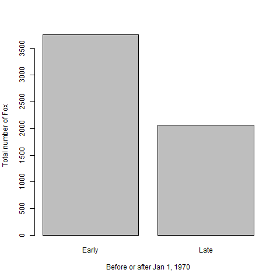
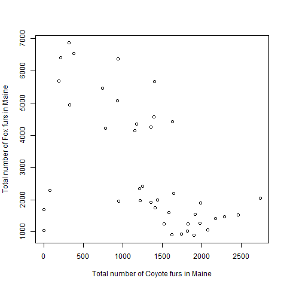

:::::::::::::::::::::::::::::::::::::: questions 

1. What are four common messages usually communicated in a chart?
2. What are useful charts to communicate these messages?
3. How do we construct text to describe these messages?
4. How does the type of data help determine the message?
5. 

::::::::::::::::::::::::::::::::::::::::::::::::

::::::::::::::::::::::::::::::::::::: objectives

After completing this episode you will be able to:

- identify data types as discrete, continuous, or categorical
- interpret and describe the message in four common chart types
- illustrate the message of four common chart types 
- use a flow diagram choose a chart type to communicate your message

::::::::::::::::::::::::::::::::::::::::::::::::

## Introduction

Charts communicate a message about data that is dependent on the type of data.  (paragraph on data types)

To discuss these data types and later decide what charts to make and how to make them (Episode 3) we are going use a long-term dataset collected on the canids of North America.  The data are presented in Newsome and Ripple 2015 .  (Give a brief summary of the paper and the data)

:::::::::::::::::::::::::::::::::::::::::::::::::::::::::::::::::::: instructor

Inline instructor notes can help inform instructors of timing challenges
associated with the lessons. They appear in the "Instructor View"

::::::::::::::::::::::::::::::::::::::::::::::::::::::::::::::::::::::::::::::::

::::::::::::::::::::::::::::::::::::: challenge 

## Challenge 1

Choose the answer that most closely reflects your opinion.
Data visualization is for ____.

a) scientists
b) everyone
c) formal reports
d) economists

:::::::::::::::::::::::: solution 

## Output
 
`b) everyone!`

:::::::::::::::::::::::::::::::::

## Challenge 2: Pair the data type names with the examples    

| Data Types  |   Example of data |
| ----------- | ----------- |
| 1. discert   |  a. 1,2,3,...1000 |
| 2. continuous  |  b. 0,1 |
| 3. catagorical  |  c. dog, cat, turtle |

:::::::::::::::::::::::: solution 

1. -> b
2. -> a
3. -> c

:::::::::::::::::::::::::::::::::
::::::::::::::::::::::::::::::::::::::::::::::::

## Data Types  

## Four Common Chart Types

Comparison
Composition
Distribution
Relationships

## Identify the message  

What is the message of this graph?  
{On average across North America throughout the collection period foxes made up 7?% and Coyotes made up 2?% of the canids}
Discuss message as a group

What is the message of this graph?  
{North American fox populations averaged 3765 (units) prior to Jan. 1, 1970 and 2062 after}
Discuss message as a group

What is the message of this graph?  
{Coyote populations in Maine ranged from zero to 2741 throughout the collections period and had a median of 1393 and mean of 1296 units}
Discuss message as a group

What is the message of this graph?  
{NEED BETTER DESCRIPTION}
Discuss message as a group

## Describe the message  

## Illustrate the message  

In a drawing application of your choice (including pencil and paper), draw a chart that matches the following descriptions.

1. The presence of wolves promoted fox abundance more than coyote abundance in the 1980s.
2. Higher mean annual air temperature decreased the ratio of foxes to coyotes across North America.
3. Overall fox abundance has a log-normal distribution.  
4. The proportion of all canids that are coyote increases from eastern to western locations.

 
## Use a flow chart to choose a chart for your message  

## Figures

You can use standard markdown for static figures with the following syntax:

`

`{alt='alt text for
accessibility purposes'}`

{indicate the percentages}

{alt='Blue Carpentries hex person logo with no text.'}

## Math

One of our episodes contains $\LaTeX$ equations when describing how to create
dynamic reports with {knitr}, so we now use mathjax to describe this:

`$\alpha = \dfrac{1}{(1 - \beta)^2}$` becomes: $\alpha = \dfrac{1}{(1 - \beta)^2}$

Cool, right?

::::::::::::::::::::::::::::::::::::: keypoints 

- Charts convey messages with interchangeable nouns and verbs
- Chart types ..
- Practice with linking chart types with charts is a valuable skill

::::::::::::::::::::::::::::::::::::::::::::::::

[r-markdown]: https://rmarkdown.rstudio.com/
