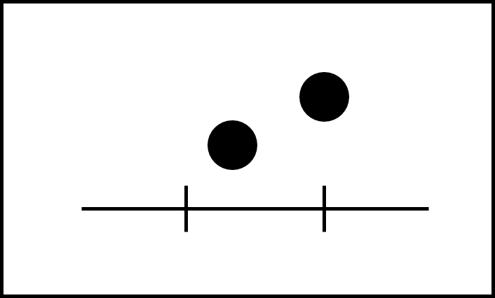
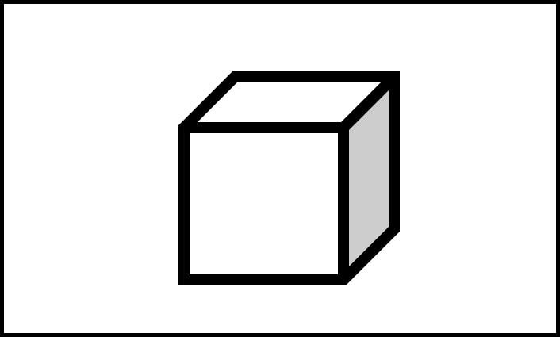

:::::::::::::::::::::::::::::::::::::: questions

- When creating a chart, what components do I have to work with?
- How can graphical elements and their visual properties support a chart's message?

::::::::::::::::::::::::::::::::::::::::::::::::

::::::::::::::::::::::::::::::::::::: objectives

- List the graphical elements and their visual properties that are available for chart design
- Identify visual representations that result in more accurate judgments about the patterns and relationships visualized by a chart

::::::::::::::::::::::::::::::::::::::::::::::::

## Graphical elements and visual properties

When we create a chart, we can choose many different ways to represent the message we wish to convey. But in two or three dimensions, there are only a few graphical elements we have to work with[^1]:

- Point
- Line
- Area
- Volume

The data and data relationships we are representing in a chart have different quantities and categories. We can communicate these quantities and categories by adjusting a graphical element's visual properties[^2]:

 - Position
 - Alignment on one or more scales
 - Length
 - Direction
 - Angle
 - Size (amount of Area or Volume)
 - Curvature
 - Shading
 - Color

[^1]: Bertin, J. (1981). Graphics and graphic information-processing (W. J. Berg & P. Scott, Trans.). de Gruyter.

[^2]: Cleveland, W. S., & McGill, R. (1984). Graphical perception — Theory, experimentation, and application to the development of graphical methods. Journal of the American Statistical Association, 79(387), 531–554. https://doi.org/10.2307/2288400

::::::::::::::::::::::::::::::::::::: challenge

## Challenge 1: Match the name of the visual property to its picture

Use this list of visual properties to label the figures below[^3].

1. Position on a common scale
2. Position on non-aligned scales
3. Length
4. Direction
5. Angle
6. Size (Area)
7. Size (Volume)
8. Curvature
9. Shading
10. Color

### Figures

{alt='color property'}
{alt='angle property'}
{alt='1 scale position property'}
{alt='curve property'}
{alt='shading property'}
{alt='area property'}
{alt='direction property'}
{alt='2 scale position property'}
{alt='length property'}
{alt='volume property'}

[^3]: Images in this challenge adapted under a [CC-BY-4.0](http://creativecommons.org/licenses/by/4.0/) license from Briney, K. (2017). "Data Visualization Camp Instructional Materials (2017)" University of Wisconsin Milwaukee Libraries Instructional Materials. https://dc.uwm.edu/lib_staff_files/4

:::::::::::::::::::::::: solution

## Answers

| Visual Property Number | Visual Property Picture |
|:---:|:---:|
| 10  | Figure 2.1 |
|  5  | Figure 2.2 |
|  1  | Figure 2.3 |
|  8  | Figure 2.4 |
|  9  | Figure 2.5 |
|  6  | Figure 2.6 |
|  4  | Figure 2.7 |
|  2  | Figure 2.8 |
|  3  | Figure 2.9 |
|  7  | Figure 2.10 |

:::::::::::::::::::::::::::::::::

:::::::::::::::::::::::::::::::::::::

## Support your chart's message

### Research on charts

### Hierarchy of visual representations

::::::::::::::::::::::::::::::::::::: keypoints

- There are four graphical elements that can represent data on a chart. The appearance of these elements can be modified with any of ten possible visual properties.
- Research suggests that many people can evaluate some of these visual representations more quickly and with more accuracy than others[^2]
- Visual representations that are easier to perceive accurately support a chart's message
- Visual representations that are more difficult to perceive accurately detract from a chart's message

::::::::::::::::::::::::::::::::::::::::::::::::
