:::::::::::::::::::::::::::::::::::::: questions

- When creating a chart, what components do I have to work with?
- Which chart components are easier for people to perceive accurately?
- How can chart components support a chart's message?

::::::::::::::::::::::::::::::::::::::::::::::::

::::::::::::::::::::::::::::::::::::: objectives

- List the graphical elements and their visual properties that are available for chart design
- Choose chart components that are easier for people to perceive accurately
- Practice choosing better charts for some common chart use cases

::::::::::::::::::::::::::::::::::::::::::::::::

## Graphical elements and visual properties

When we create a chart, we can choose many different ways to represent the message we wish to convey. But in two or three dimensions, there are only a few graphical elements we have to work with[^1]:

- Point
- Line
- Area
- Volume

The data and data relationships we are representing in a chart have different quantities and categories. We can communicate this information through a graphical element's visual properties[^2]:

 - Position
 - Alignment on one or more scales
 - Length
 - Direction
 - Angle
 - Size (amount of Area or Volume)
 - Curvature
 - Shading
 - Color

[^1]: Bertin, J. (1981). Graphics and graphic information-processing (W. J. Berg & P. Scott, Trans.). de Gruyter.

[^2]: Cleveland, W. S., & McGill, R. (1984). Graphical perception — Theory, experimentation, and application to the development of graphical methods. Journal of the American Statistical Association, 79(387), 531–554. https://doi.org/10.2307/2288400

::::::::::::::::::::::::::::::::::::: challenge

## Challenge: Visual properties

Use this list of visual properties to label the figures below[^3].

1. Position on a common scale
2. Position on non-aligned scales
3. Length
4. Direction
5. Angle
6. Size (Area)
7. Size (Volume)
8. Curvature
9. Shading (black, white, and gray)
10. Color

### Figures

{alt='color property'}

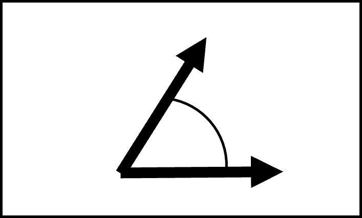{alt='angle property'}

{alt='1 scale position property'}

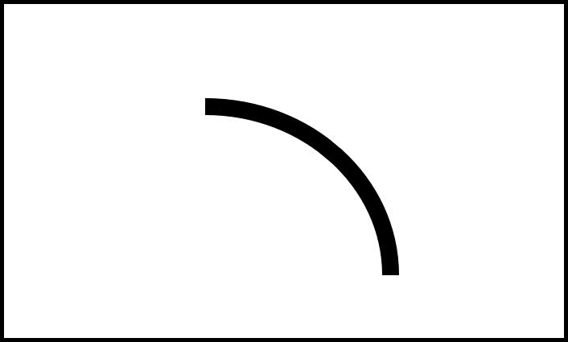{alt='curve property'}

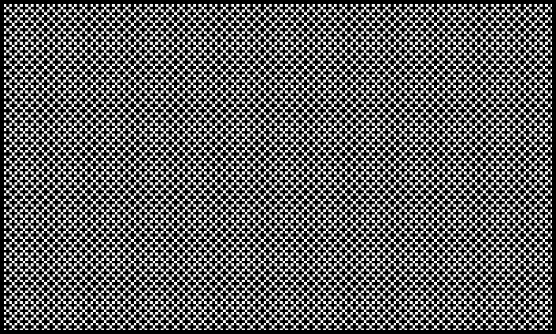{alt='shading property'}

{alt='area property'}

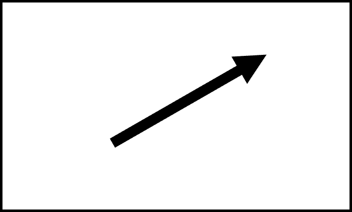{alt='direction property'}

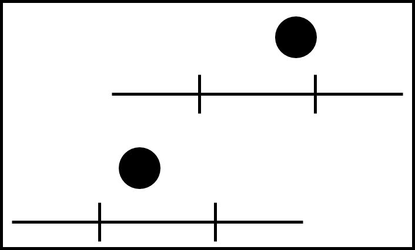{alt='2 scale position property'}

{alt='length property'}

{alt='volume property'}

[^3]: Images in this challenge adapted under a [CC-BY-4.0](http://creativecommons.org/licenses/by/4.0/) license from Briney, K. (2017). "Data Visualization Camp Instructional Materials (2017)" University of Wisconsin Milwaukee Libraries Instructional Materials. https://dc.uwm.edu/lib_staff_files/4

:::::::::::::::::::::::: solution

## Answers

| Visual Property Number | Visual Property Picture |
|:---:|:---:|
| 10  | Figure 2.1 |
|  5  | Figure 2.2 |
|  1  | Figure 2.3 |
|  8  | Figure 2.4 |
|  9  | Figure 2.5 |
|  6  | Figure 2.6 |
|  4  | Figure 2.7 |
|  2  | Figure 2.8 |
|  3  | Figure 2.9 |
|  7  | Figure 2.10 |

:::::::::::::::::::::::::::::::::

:::::::::::::::::::::::::::::::::::::

::::::::::::::::::::::::::::::::::::: discussion

### Common chart types and their components

Spend three minutes with your neighbor talking about chart types you often see and which graphical elements and/or visual properties they include. Share your answers in the shared document.

::::::::::::::::::::::::::::::::::::::::::::::::

::::::::::::::::::::::::::::::::::::: instructor

### Possible answers

Some possible answers to this discussion include:

- Scatter chart: points on one or more scales
- Bar chart: length, area, shading or color
- Pie chart: angle, curvature, area, shading or color

Spreadsheet programs and other software can turn most two-dimensional charts into three-dimensional charts. Use examples such as three-dimensional pie and bar charts to incorporate volume into this discussion.

::::::::::::::::::::::::::::::::::::::::::::::::

## Better visual representations

Depicting information visually is as much art as science, but some research-backed guidelines can help us design a chart that is easier for people to perceive accurately. These guidelines are the result of experiments conducted by two statisticians in the 1980s[^2]. Despite their study's limitations, the guidelines they produced remain useful and inform modern guidance about designing charts[^4].

These guidelines help us understand and categorize graphical elements and visual properties in terms of "better" and "worse" depictions of the underlying data:

- "Better" means easier to perceive accurately
- "Worse" means more difficult to perceive accurately

[^4]: Evergreen, S. D. H. (2017). Effective data visualization: The right chart for the right data. Los Angeles: SAGE.

### Graphical Elements

- Points are better than lines
- Lines are better than area (two-dimensional shape)
- Area (two-dimensional shape) is better than volume (three-dimensional shape)

### Visual Properties

| Graphical element | Better | Worse |
| ---- | ---- | ---- |
| Points | Position on common scale | Position on non-aligned scales |
| Lines | Length, Direction, Angle | Curvature |
| Shapes | Area | Volume |

### Shading and color are special cases

Shading and color can be both better and worse, depending on how they are used in a chart.

Some better uses:

- Differentiate categories or other non-numeric data using a graduated scale or contrasting colors
- Draw attention to areas of a chart that most clearly represent patterns or relationships in the data

Some worse uses:

- Muddle categories by using colors that are too similar
- Distract from a chart's message by using too many colors or having no clear purpose for the chosen color or shading

We need to ask some questions when including shading or color in a chart:

- How many categories am I working with?
- Are my colors accessible?
- What assumptions are my colors making?
- How will my chart be distributed?

[ColorBrewer 2.0](https://colorbrewer2.org) is an online tool for testing color schemes against various conditions. The tool targets cartography but is useful for choosing colors for any kind of data.

::::::::::::::::::::::::::::::::::::: instructor

### Shading and color discussion

With enough time, you may choose to structure the questions about shading and color as a discussion or brainstorm in the shared document. Some rationale for each question is included below.

- How many categories am I working with?
  - Using color to differentiate more than 4-5 categories can make the colors too similar to each other.
- Are my colors accessible?
  - Color blindness can affect how people perceive certain colors and color combinations, e.g.: red/green and blue/yellow.
  - People with visual impairments have difficulty perceiving low-contrast colors.
- What assumptions are my colors making?
  - Relying on specific contrasting colors, e.g.: red/green or red/yellow/green, to communicate a message assumes that the colors mean the same thing to your audience that they do to you.
- How will my chart be distributed?
  - Printing and photocopying can distort or erase gray and color tones.
  - Monitors and projectors cannot always replicate color accurately.

::::::::::::::::::::::::::::::::::::::::::::::::

## Support your chart's message

::::::::::::::::::::::::::::::::::::: callout

### Remember

The purpose of a chart is to communicate a message about patterns or relationships present in the data.

::::::::::::::::::::::::::::::::::::::::::::::::

"Better" and "Worse" are comparative states. There is no one best or worst way to communicate a message about a relationship or pattern in a set of data. Instead, we can focus on designing better charts - charts that use components that are easier to perceive accurately.

Better charts can help our audience understand our message and support their decision-making with reliable information.

Worse charts - charts designed using components that are more difficult to perceive accurately - can obscure our message and misinform our audience.

::::::::::::::::::::::::::::::::::::: instructor

Depending on time and your learners' interest, this definition of worse charts can be a place to point out that charts that deliberately obscure a message or mislead an audience often include multiple components that are more difficult to perceive accurately. Learners can use this knowledge to bring a critical lens to charts they come across in ordinary life.

::::::::::::::::::::::::::::::::::::::::::::::::

::::::::::::::::::::::::::::::::::::: challenge

## Challenge: Practice choosing better charts

For each chart use case, put the example charts in order from better to worse. Write a note to yourself about why you think one chart is better than another.

### Chart Use Case 1

A chart that depicts parts of a whole.

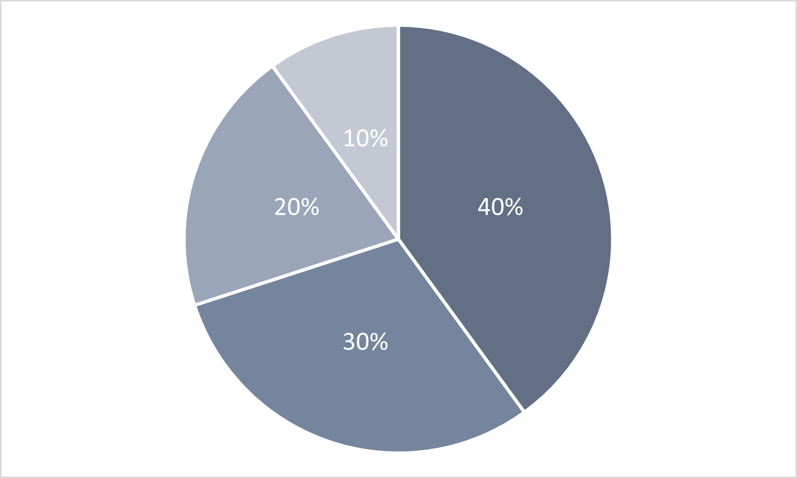{alt='two dimensional pie chart'}

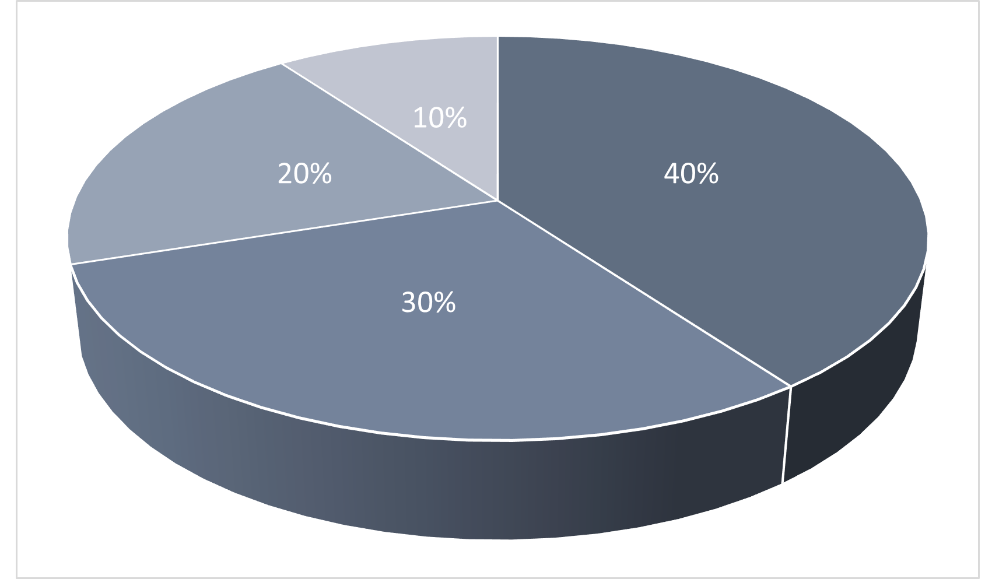{alt='three dimensional pie chart'}

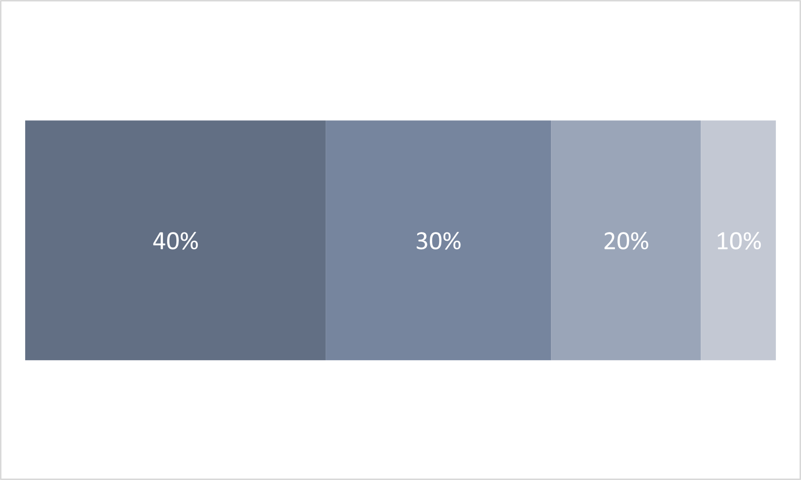{alt='100% bar chart'}

:::::::::::::::::::::::: solution

In order from better to worse, the charts are:

- Figure 2.13: 100% Bar Chart
- Figure 2.11: 2D Pie Chart
- Figure 2.12: 3D Pie Chart

:::::::::::::::::::::::::::::::::

### Chart Use Case 2

A chart that compares two categories over a period of time.

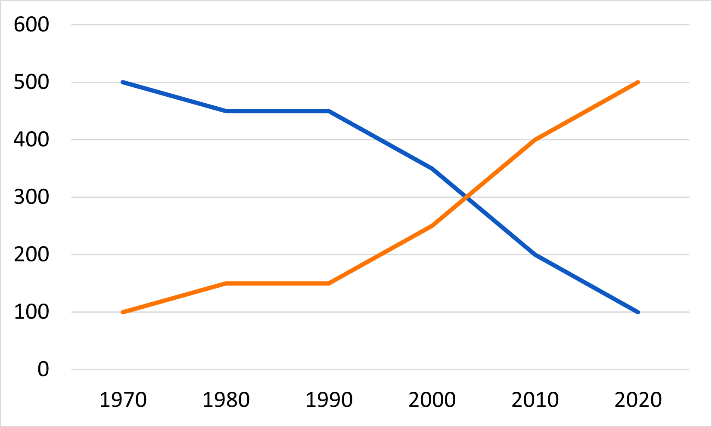{alt='two dimensional line chart'}

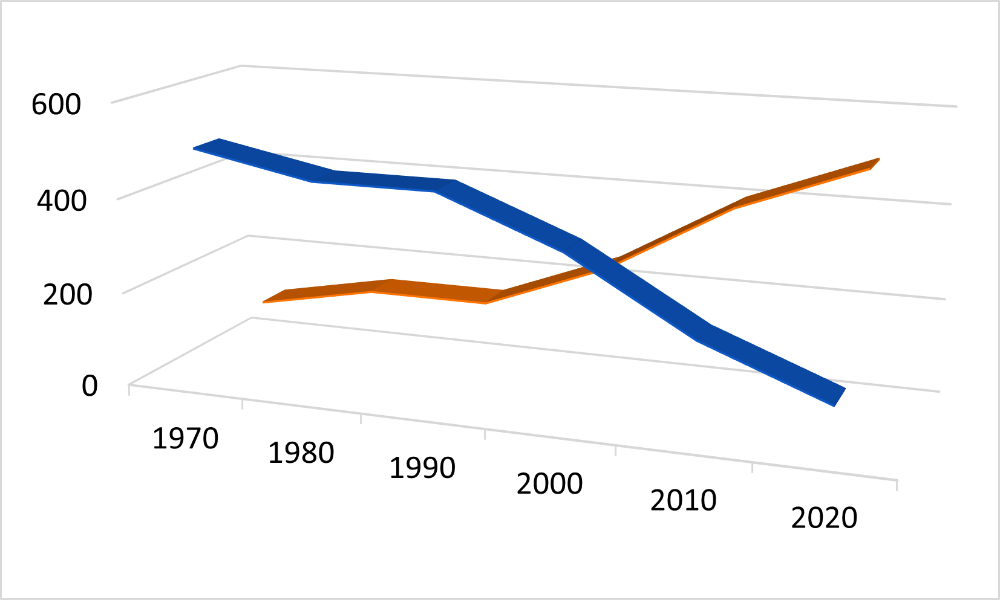{alt='three dimensional line chart'}

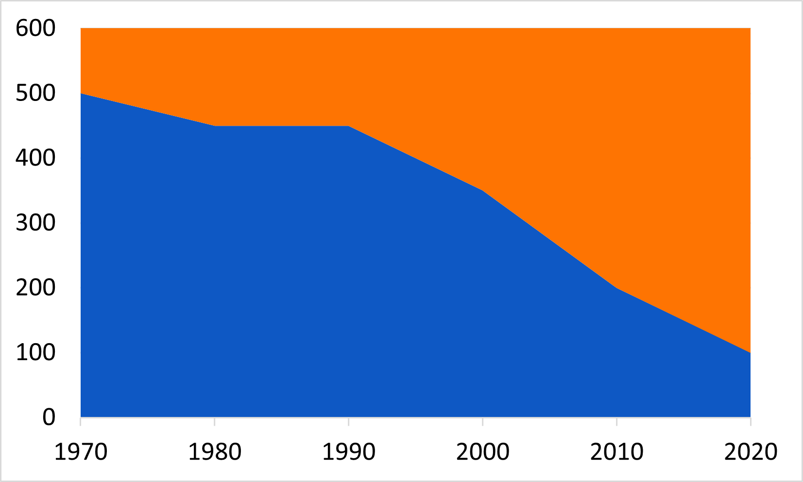{alt='two dimensional area chart'}

:::::::::::::::::::::::: solution

In order from better to worse, the charts are:

- Figure 2.14 2D Line Chart
- Figure 2.16 2D Area chart
- Figure 2.15 3D Line Chart

:::::::::::::::::::::::::::::::::

::::::::::::::::::::::::::::::::::::::::::::::::

::::::::::::::::::::::::::::::::::::: instructor

In order to reinforce why one chart is better than another in the above challenge, have learners share their "whys" in the shared document or aloud during a brief discussion of the solutions. The correct answers correspond to the information in the section, "Better Visual Representations."

::::::::::::::::::::::::::::::::::::::::::::::::

::::::::::::::::::::::::::::::::::::: keypoints

- There are four graphical elements that can represent data on a chart. The appearance of these elements can be modified with any of ten possible visual properties.
- Research suggests that many people can evaluate some of these visual representations more quickly and with more accuracy than others.
- Visual representations that are easier to perceive accurately support a chart's message.
- Visual representations that are more difficult to perceive accurately obscure a chart's message.

::::::::::::::::::::::::::::::::::::::::::::::::
