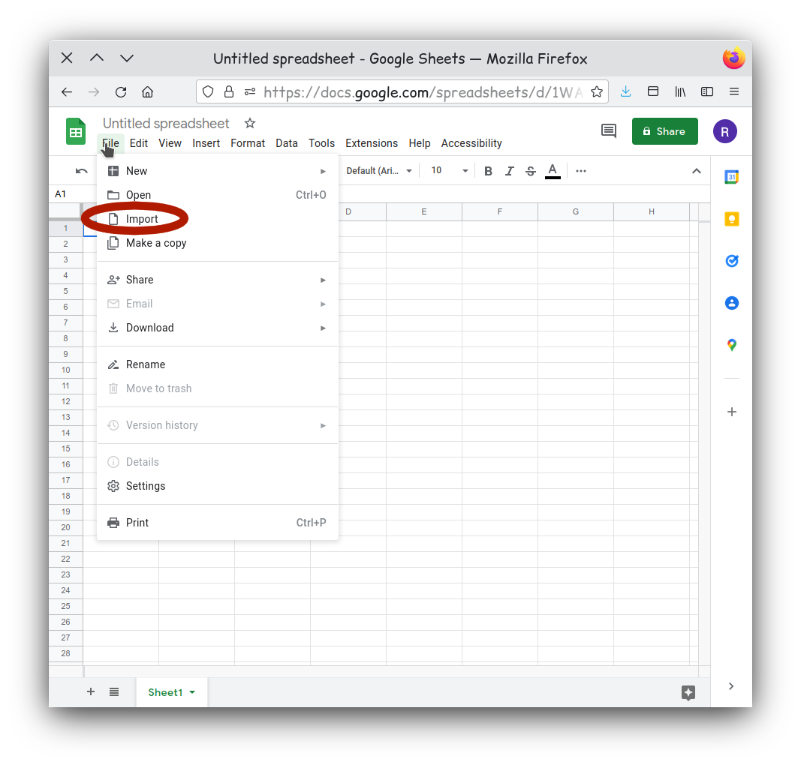
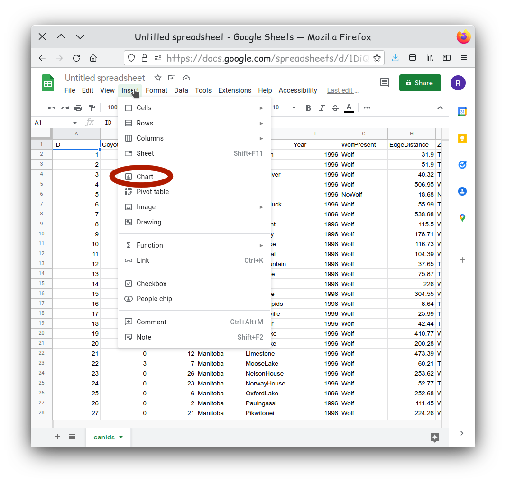
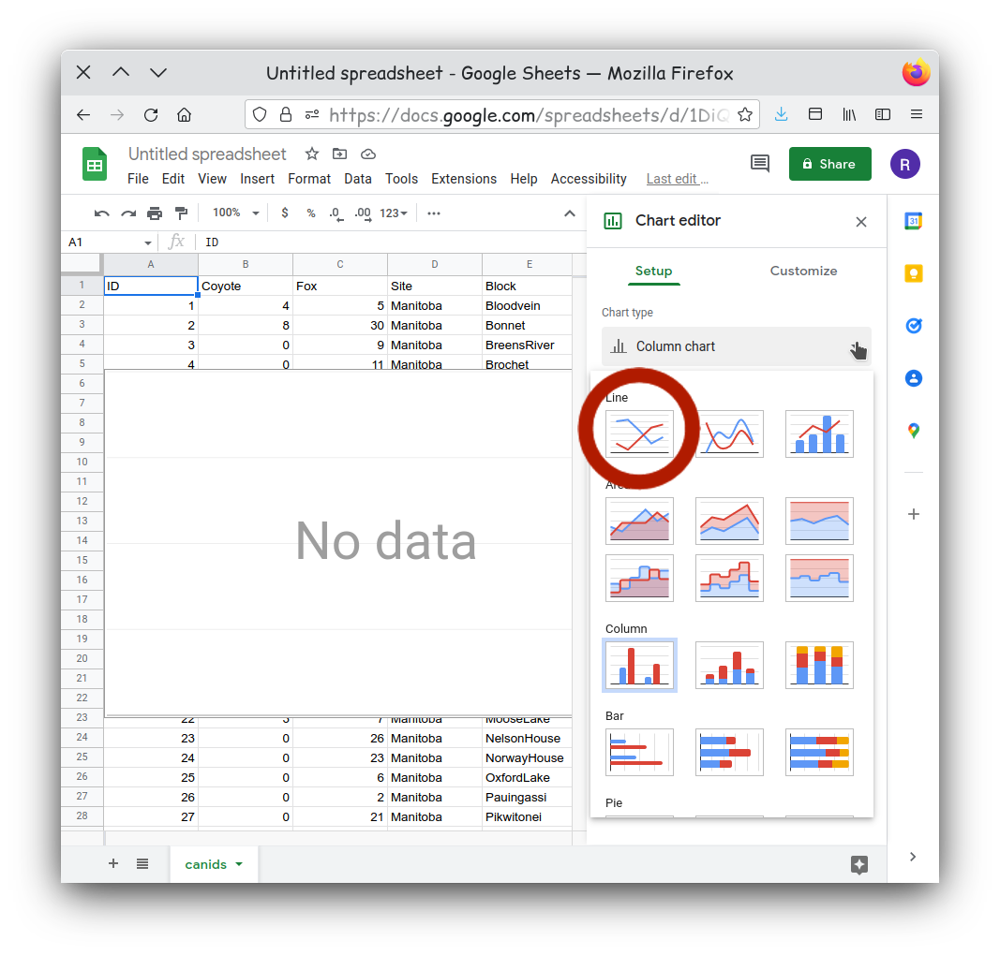
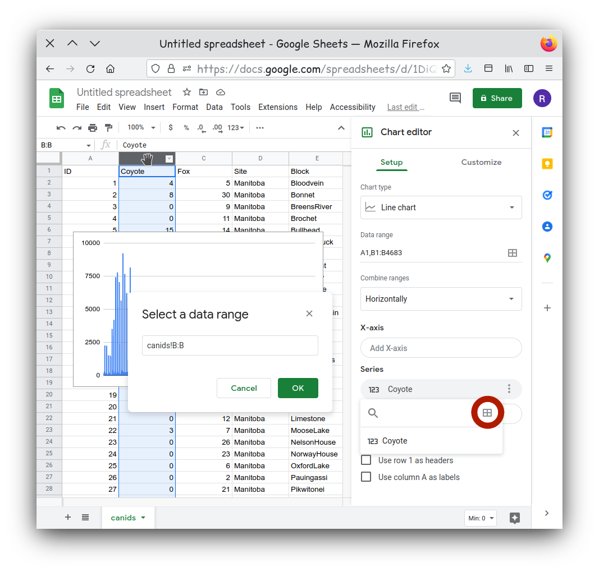
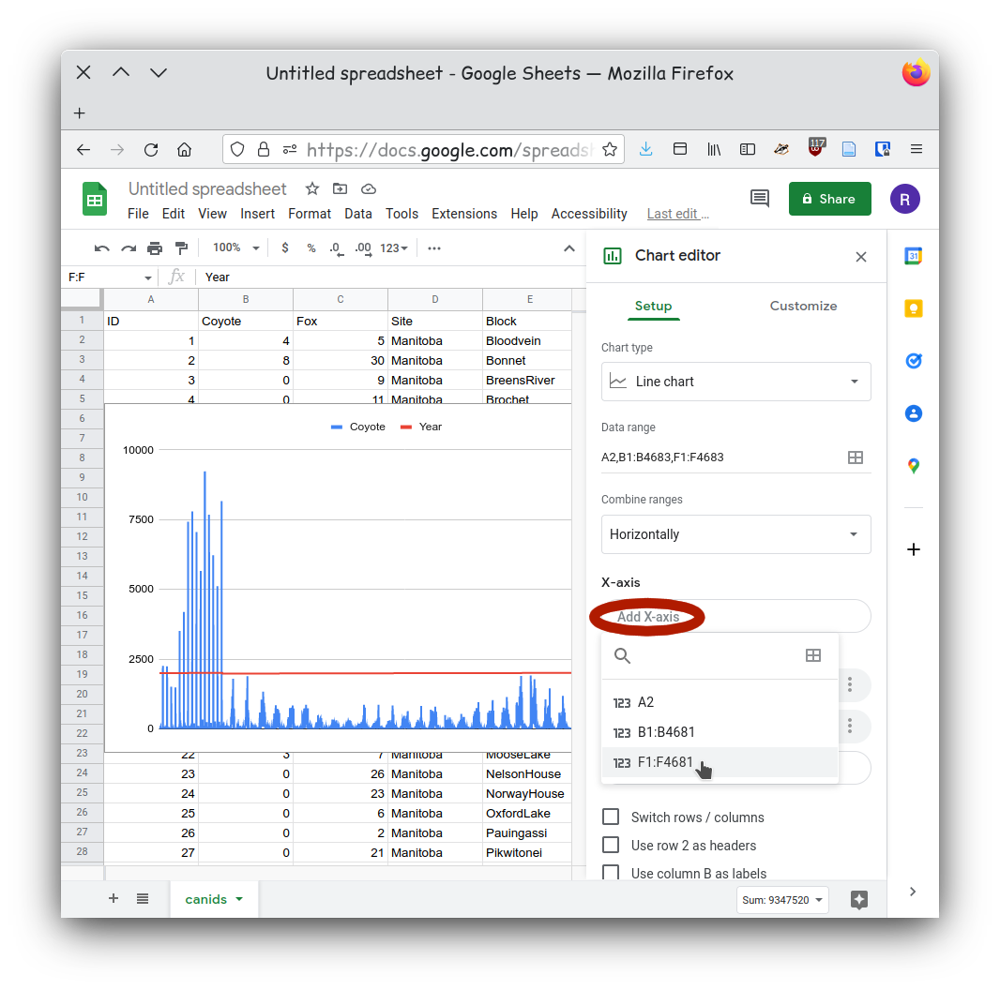
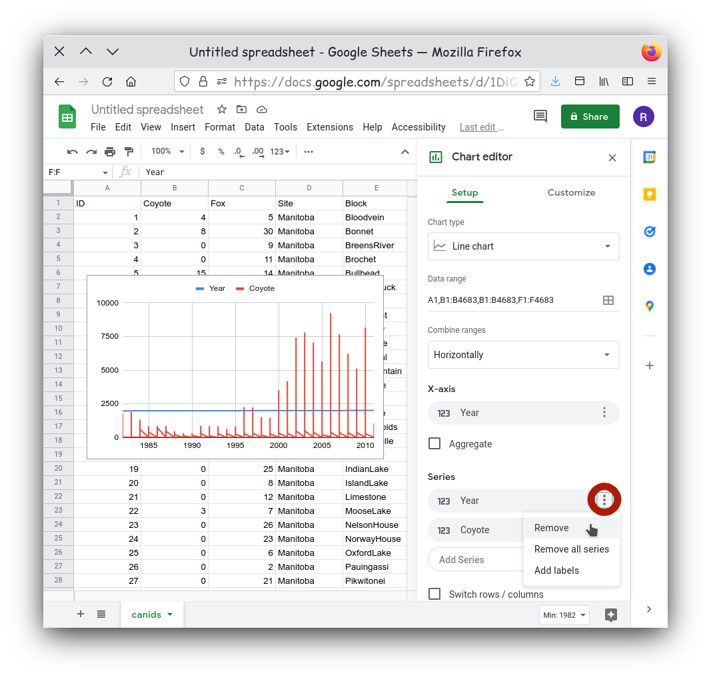
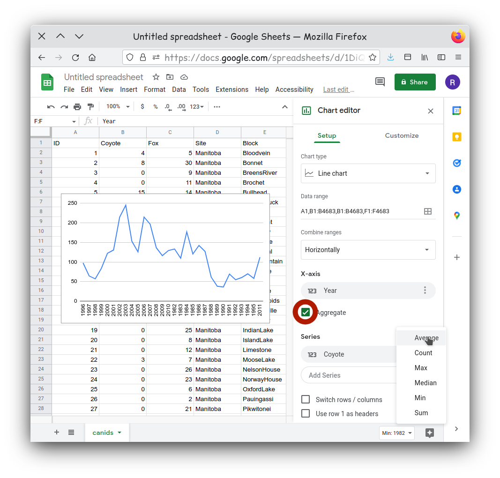
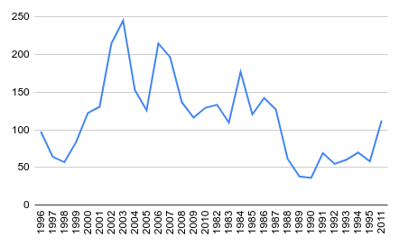
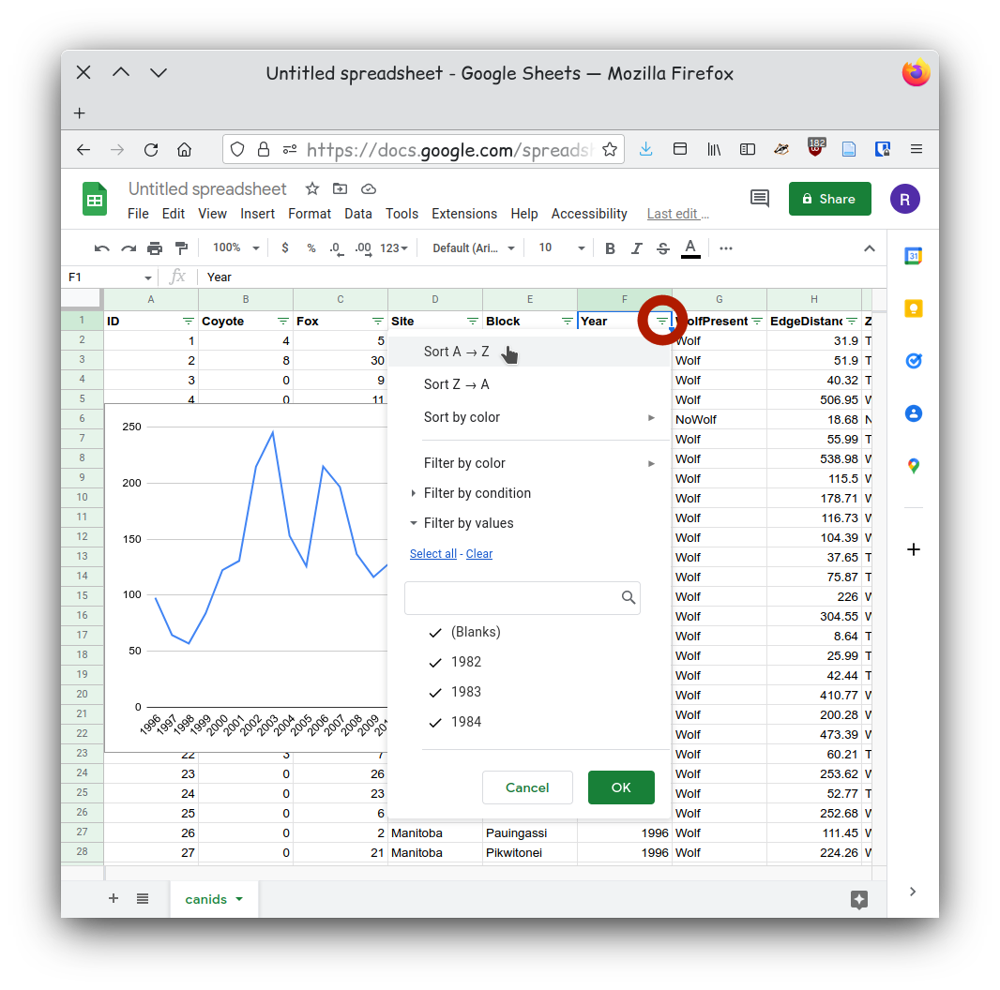

:::::::::::::::::::::::::::::::::::::: questions 

1. What is the important aspects of a dataset you want to communicate?
2. What is the best visualization type for a particular dataset?

::::::::::::::::::::::::::::::::::::::::::::::::

::::::::::::::::::::::::::::::::::::: objectives

- Identify what message would like to communicate about a dataset.
- Identify how to best communicate the message with appropriate visuals.
- Generate graphs based on your decisions using software.

::::::::::::::::::::::::::::::::::::::::::::::::

## Introduction

This chapter will use the knowledge you have gained and apply it to generate graphs using software tools. What you should know:

1. There are a multitude of software tools that can help generate charts for you.
2. All software tools have the strengths and weaknesses. There is no best tool for all tasks or all users.
3. For this lessen we will be using google sheets. For our purposes this tool has some important advantages.
    1. The software is freely available online.
    2. The software works similarly regardless of the users operating system
    3. The software is interacted primarily through a graphical interface that can make it more intuitive to new users.

:::: instructor

Other tools can have many advantages as well. Certain software which use a command line interface may have a steeper learning curve, but has other advantages such as improved reproducibility. 

## Importing your Data
We need to import our canid data into google sheets. Our data is currently stored as tab seperated values, otherwise known as a tsv file. This is a simple text file. Each line of the file represents a new line in a table. The values in each column of the table appear in sequence separated by a tab character. Generally tsv tables have the limitation that you can't store any values in a table that also has a tab character. If you haven't already, go ahead and download the canid data now. 

[Your Data](data/canids.tsv)

To import this into google sheets you first need to go to the website . It will prompt you to log into a google account. You will need to use a google account to use google sheets, but if you do not have one, they are free [Google Account Sign-up](https://accounts.google.com/signup/v2/webcreateaccount?biz=false&flowName=GlifWebSignIn&flowEntry=SignUp&hl=en).

While there you will want to create a new blank spreadsheet.

{alt='new google sheet'}

Then navigate to the file menu and select "Import".

{alt='google sheet import'}

Select the "Upload" tab on the new window. Here you can drag and drop you canids.tsv onto the window. You can also click "Select a file from your device" if you prefer to navigate to your file.

{alt='google sheet upload'}

Tab seperated files are well supported on Google Sheets, and the default import options should be fine. If your have issues you could try setting the selector type to "Tab".

{alt='google sheet file type'}

Your data should now be imported and visible in a new sheet.

{alt='google sheet file type'}

:::: challenge 

## Activity 1
Examine your dataset. Does it appear to be clean and tidy?

Remember clean data has no:
- White spaces before or after data in each cell
- Outliers, nulls, missing data, or empty cells
- Formatting, such as color coding, bold, or italicized text

Also, tidy data is organized so that:
- Columns are for variables
- Rows are for observations
- One value per cell

::::

## Lets Make a Chart

For our first chart lets show the relationship of the counts of coyotes over time. To generate a blank chart we will need to click on the insert menu and select chart.

{alt='new chart insert menu'}

We now have a blank chart and the chart editor window has opened. Here we will want to start specifying our data. Lets start with our chart type . Select line from the dropdown menu. 

{alt='new chart type menu'}

We need to pick our first data series. This will become our y-axis data. Lets pick the count of coyotes. Click on the add series button below the Series heading. This will automatically open the Select data range menu if its empty. If you happened to already have a data series selected for you. Click on the field below the Series heading and this should open a menu with a search field on the right with a rectangular grid icon on the left. Clicking that grid will open the Select data range menu. Once the Select data range menu is open you can select column B "Coyote". Click ok when your done.

{alt='new chart type coyote'}

We can now specify the data for our x -axis. Lets start with the x-axis. Click on the field below the X-axis heading in the chart editor, and again this should open a menu with a search field on the right with a rectangular grid icon on the left. Once the Select data range menu is open. Now you can click the top of the Column named year in your table to set year as our x-axis. 

{alt='new chart type year'}

Sometimes the chart editor will automatically set this as a data series instead of your x-axis. This is ok, if you click on the x-axis field again you will see year is now an option. Go ahead and click it to set you x-axis. You will need to remove year from the data series list by clicking the three dot icon and selecting remove.

{alt='new chart type year remove'}

Something doesn't look right. Our line chart seems to be jumping back and forth at each year. If you look at the table you will notice that for every year value we have multiple rows. By default the chart is plotting every row as an independent point, so we have multiple points at every year. Is that  really what we want to show? It might be better to show some aggregate value for each year. That would mean a simpler chart and a simpler message. Lets try plotting the average (arithmetic mean) counts of coyotes instead. Click the agregate checkbox and a new dropdown will appear. Select average to plot our mean counts.

{alt='new chart type year remove'}

That looks better, but can you see another issue? Look closely.
{alt='new chart type error'}

Our years are not in order! The years are plotted in the order they appeared on our table. One simple way to solve this is to reorder our table. Select the column year. Now from the data menu select sort sheet -> Sort sheet by column F (A-Z). 

{alt='new chart type sort'}

Now that our data is sorted our chart should show our data in chronological order.

:::: keypoints 

- Identify if you are communicating a comparison, distribution, composition, relationship.
- Use the chart chooser a good chart for your particular dataset.
- Choose the tool you will be using to generate your chart
- Import your data making sure your data is "clean" and "tidy".
::::
