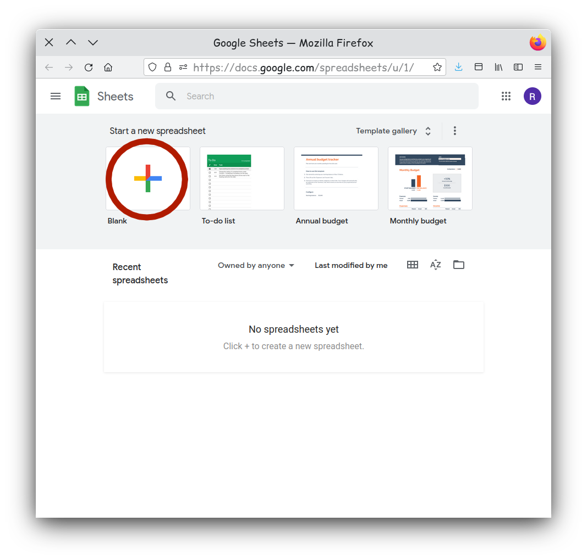
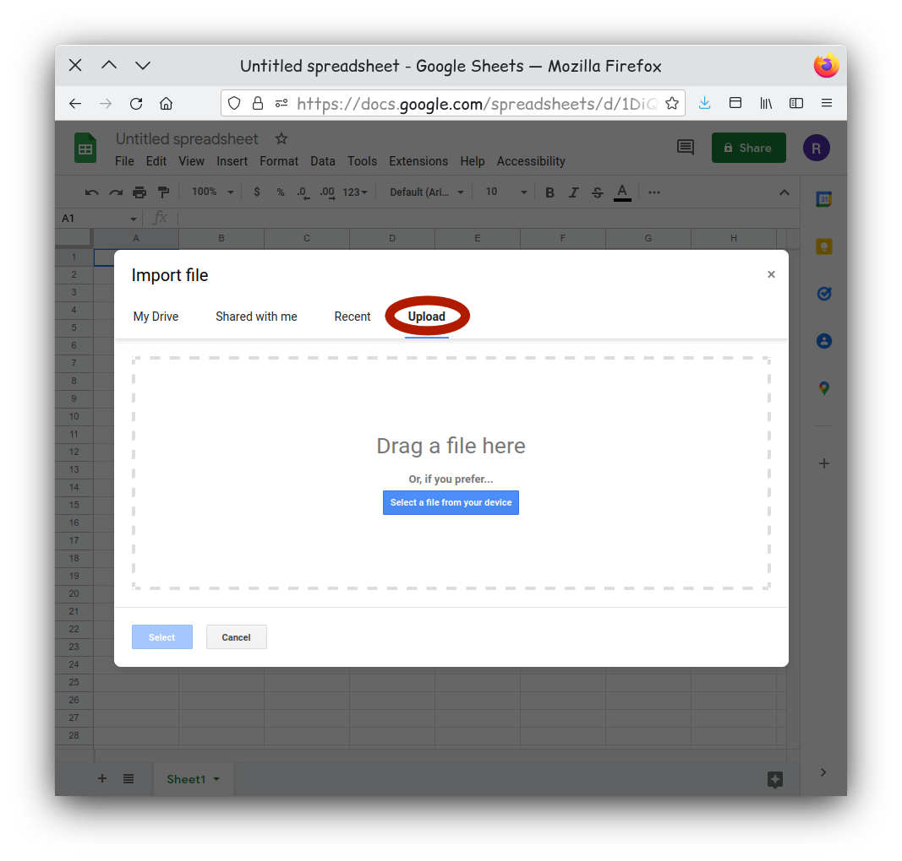
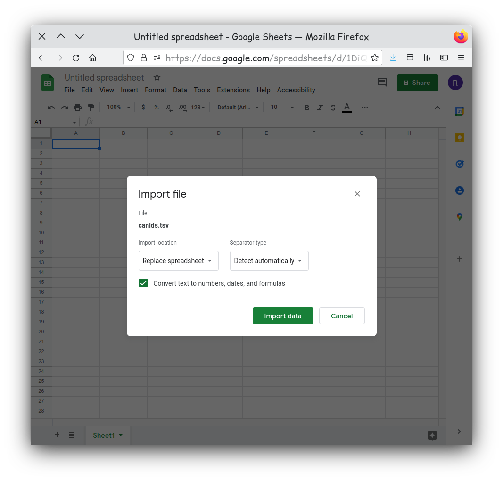
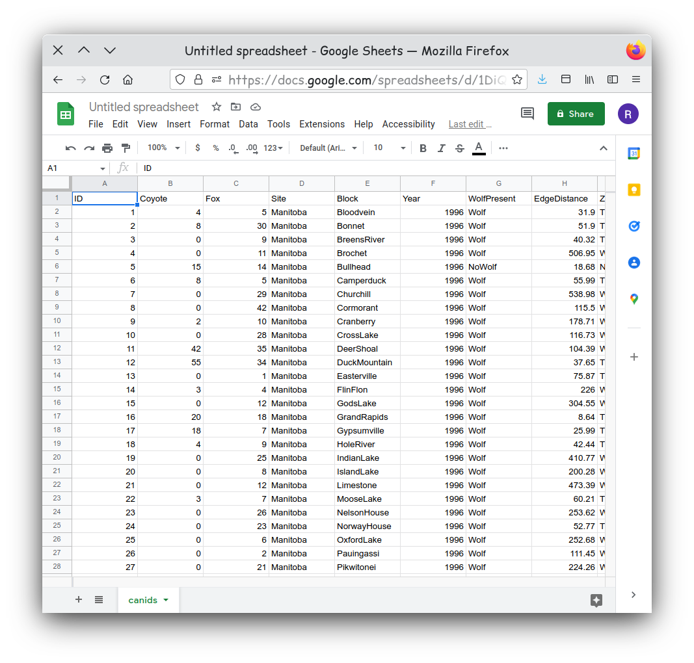

:::::::::::::::::::::::::::::::::::::: questions 

1. What is the important aspects of a dataset you want to communicate?
2. What is the best visualization type for a particular dataset?

::::::::::::::::::::::::::::::::::::::::::::::::

::::::::::::::::::::::::::::::::::::: objectives

- Identify what message would like to communicate about a dataset.
- Identify how to best communicate the message with appropriate visuals.
- Generate graphs based on your decisions using software.

::::::::::::::::::::::::::::::::::::::::::::::::

## Introduction

This chapter will use the knowlege you have gained and apply it to generate graphs using software tools. What you should know:

1. There are a multitude of software tools that can help generate charts for you.
2. All software tools have the strengths and weaknesses. There is no best tool for all tasks or all users.
3. For this lessen we will be using google sheets. For our purposes this tool has some important advantages.
    1. The software is freely available online.
    2. The software works similarly regardless of the users operating system
    3. The software is interacted primarily through a graphical interface that can make it more intuitive to new users.

:::: instructor

Other tools can have many advantages as well. Certain software which use a command line interface may have a steeper learning curve, but has other advantages such as improved. reproducibility. 

::::

:::: challenge 

## Question 1
You have data on the number of carrots consumed by hares and by tortoises, what kind of message do you want to communicate

1. The relationship between number of hares and number of carrots of consumed
2. The distribution of hares and tortoises
3. A comparison of the number of carrots eaten by tortoises and hares

::: solution 

## Solution
### Answer 3
You have two groups each having consumed a different number of carrots, this is best described as a comparison.

:::
::::

## Importing your Data
We need to import our canid data into google sheets. Our data is currently stored as tab seperated values, otherwise known as a tsv file. This is a simple text file. Each line of the file represents a new line in a table. The values in each column of the table appear in sequence seperated by a tab character. Generally tsv tables have the limitation that you can't store any values in a table that also has a tab character. If you haven't already, go ahead and download the canid data now. 

[Your Data](data/canids.tsv)

To import this into google sheets you first need to go to the website . It will prompt you to log into a google account. You will need to use a google account to use google sheets, but if you do not have one, they are free [Google Account Sign-up](https://accounts.google.com/signup/v2/webcreateaccount?biz=false&flowName=GlifWebSignIn&flowEntry=SignUp&hl=en).

While there you will want to create a new blank spreadsheet.

{alt='new google sheet'}

Then navigate to the file menu and select "Import".

{alt='google sheet import'}

Select the "Upload" tab on the new window. Here you can drag and drop you canids.tsv onto the window. You can also click "Select a file from your device" if you prefer to navigate to your file.

{alt='google sheet upload'}

Tab seperated files are well supported on Google Sheets, and the default import options should be fine. If your have issues you could try setting the selector type to "Tab".

{alt='google sheet file type'}

Your data should now be imported and visible in a new sheet.

{alt='google sheet file type'}

:::: challenge 

## Activity 1
Examine your dataset. Does it appear to be clean and tidy?

Remember clean data has no:
  - White spaces before or after data in each cell
  - Outliers, nulls, missing data, or empty cells
  - Formatting, such as color coding, bold, or italicized text

Also, tidy data is organized so:
  - Columns are for variables
  - Rows are for observations
  - One value per cell

::::

:::: keypoints 

- Identify if you are communicating a comparison, distribution, composition, relationship.
- Use the chart chooser a good chart for your particular dataset.
- Choose the tool you will be using to generate your chart
- Import your data making sure your data is "clean" and "tidy".
::::
